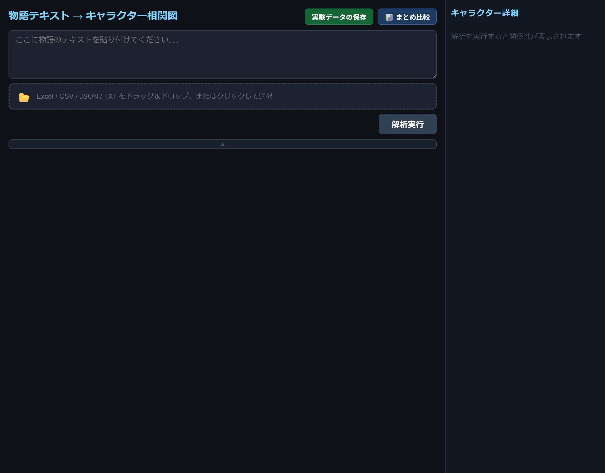
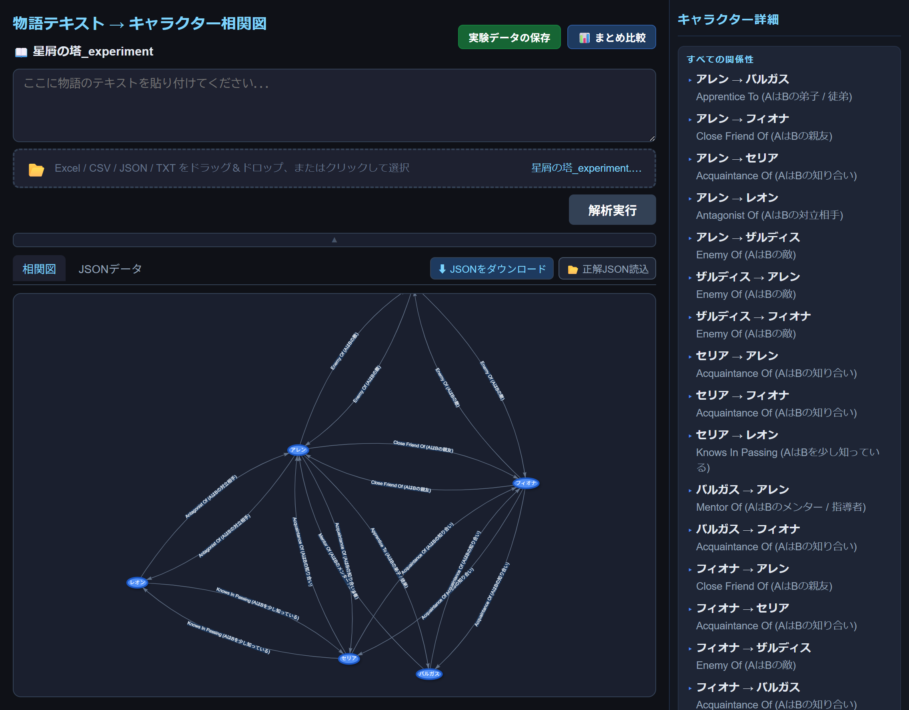

# 物語テキスト キャラクター相関図 自動生成システム

物語テキストを入力すると、Google Gemini API がキャラクターと関係性を自動抽出し、インタラクティブな相関図として可視化するWebアプリです。

## スクリーンショット

入力画面


解析結果（相関図）


## 主な機能

・「テキスト解析」: 貼り付けたテキストや Excel / CSV / TXT ファイルから物語を読み込み、Gemini API でキャラクターと関係性を自動抽出
・「相関図表示」: vis-network による有向グラフ。ノードをクリックすると関連エッジを強調表示
・「複数作品対応」: 複数のファイルを同時に読み込み、作品単位で切り替えながら比較
・「JSON出力」: 抽出結果をJSON形式でダウンロード
・「評価機能」: 正解JSONを読み込んでF1スコア（適合率・再現率）を算出し、比較結果をExcelで出力
・「まとめ比較」: 複数作品のF1比較ファイルをまとめて集計

## 技術スタック

・「フレームワーク」: Nuxt 3 (Vue 3)
・「相関図描画」: vis-network
・「AI解析」: Google Gemini API
・「ファイル処理」: SheetJS (xlsx)

## セットアップ

```bash
npm install
```

`.env` ファイルを作成し、Gemini APIキーを設定：

```
NUXT_GEMINI_API_KEY=your_api_key_here
```

開発サーバーの起動：

```bash
npm run dev
```

ブラウザで `http://localhost:3000` を開く。

## 使い方

・テキストエリアに物語テキストを貼り付けるか、ファイル（Excel / CSV / JSON / TXT）をアップロード
・「解析実行」ボタンをクリック
・相関図タブで結果を確認。右サイドバーでキャラクターの関係性一覧を参照
・必要に応じてJSONをダウンロードするか、正解JSONと比較してF1評価を実施
